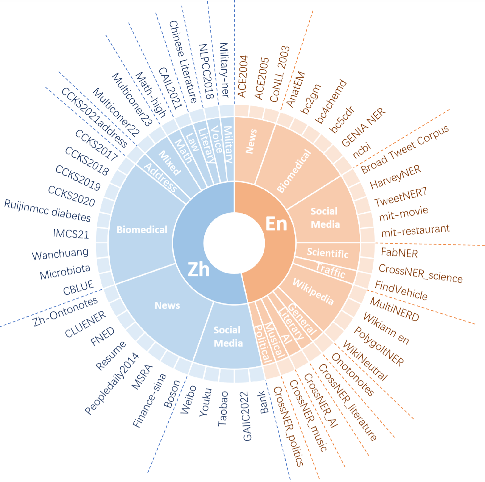

<p align="center">
 <br>
 
 <h2 align="center">Beyond Boundaries: Learning a Universal Entity Taxonomy <br> across Datasets and Languages for Open Named Entity Recognition <br> (B<sup>2</sup>NER) </h2>
</p>

<p align="center">
 <a href="https://github.com/UmeanNever/B2NER/blob/main/LICENSE"></a>
 <a href="http://arxiv.org/abs/2406.11192"></a>
 <a href="https://huggingface.co/datasets/Umean/B2NERD"></a>
<a href="https://huggingface.co/Umean/B2NER-Internlm2-20B-LoRA"></a>
</p>

We present B2NERD, a cohesive and efficient dataset that can improve LLMs' generalization on the challenging Open NER task, refined from 54 existing English or Chinese datasets. 
Our B2NER models, trained on B2NERD, outperform GPT-4 by 6.8-12.0 F1 points and surpass previous methods in 3 out-of-domain benchmarks across 15 datasets and 6 languages. 

 - 📖 Paper: [Beyond Boundaries: Learning a Universal Entity Taxonomy across Datasets and Languages for Open Named Entity Recognition](http://arxiv.org/abs/2406.11192)
 - 🎮 Code Repo: https://github.com/UmeanNever/B2NER
 - 📀 Data: See below data section. You can download from [HuggingFace](https://huggingface.co/datasets/Umean/B2NERD) or [Google Drive](https://drive.google.com/file/d/11Wt4RU48i06OruRca2q_MsgpylzNDdjN/view?usp=drive_link).
 - 💾 Model (LoRA Adapters): See below model & code usage section. We provide light-weight trained LoRA adapters for direct usage.

Feature Highlights:
 - Curated dataset (B2NERD) refined from the largest bilingual NER dataset collection to date.
 - Achieves SoTA OOD NER performance across multiple benchmarks with light-weight LoRA adapters (<=50MB).
 - Uses simple natural language format prompt, achieving 4X faster inference speed than previous SoTA which use complex prompts.
 - Easy integration with other IE tasks by adopting UIE-style instructions. 
 - Provides a universal entity taxonomy that guides the definition and label naming of new entities.

| Model | Avg. F1 on OOD English datasets  | Avg. F1 on OOD Chinese datasets | Avg. F1 on OOD multilingual dataset
|-------|------------------------|------------------------|--|
| Previous SoTA | 69.1    |  42.7     | 36.6
| GPT         | 60.1    |  54.7     | 31.8
| B2NER | **72.1**    |  **61.3**     | **43.3**


# Release 📆
 - **[July 8]** We released our models supporting direct usage of our B2NER models. We also provide sample model predictions from our models.
 - **[July 5]** We released our codes supporting the training and inference of our B2NER models.
 - **[June 18]** We released our papar and data. Our B2NERD dataset is highly suitable for training out-of-domain / zero-shot NER models.

# Data
One of the paper's core contribution is the construction of B2NERD dataset. It's a cohesive and efficient collection refined from 54 English and Chinese datasets and designed for Open NER model training.  
We provide 3 versions of our dataset.  
 - `B2NERD` (Recommended): Contain ~52k samples from 54 Chinese or English datasets. This is the final version of our dataset suitable for out-of-domain / zero-shot NER model training. It features standardized entity definitions and pruned, diverse data.  
 - `B2NERD_all`: Contain ~1.4M samples from 54 datasets. The full-data version of our dataset suitable for in-domain supervised evaluation. It has standardized entity definitions but does not undergo any data selection or pruning.  
 - `B2NERD_raw`: The raw collected datasets with raw entity labels. It goes through basic format preprocessing but without further standardization.

You can download the data from [HuggingFace](https://huggingface.co/datasets/Umean/B2NERD) or [Google Drive](https://drive.google.com/file/d/1JW3ZZPlJ5vm_upn0msihI9FQjo4TmZDI/view?usp=sharing).  
Please ensure that you have the proper licenses to access the raw datasets in our collection.

Below are the datasets statistics and source datasets for `B2NERD` dataset.

| Split | Lang. | Datasets | Types | Num | Raw Num |
|-------|-------|----------|-------|-----|---------|
| Train | En    | 19       | 119   | 25,403 | 838,648 |
|       | Zh    | 21       | 222   | 26,504 | 580,513 |
|       | Total | 40       | 341   | 51,907 | 1,419,161 |
| Test  | En    | 7        | 85    | -     | 6,466   |
|       | Zh    | 7        | 60    | -     | 14,257  |
|       | Total | 14       | 145   | -     | 20,723  |



More dataset information can be found in the Appendix of paper.

# Model & Code Usage 

We generally follow and update [InstructUIE](https://github.com/BeyonderXX/InstructUIE)'s repo to build our codes. 

## Model Checkpoints (LoRA Adapters)

Here we provide trained LoRA adapters that can be applied to InternLM2-20B and InternLM2.5-7B, respectively. You can directly download them (less than 50MB) and use them to do inference following instructions in below Sample Usage - Inference subsection.
- B2NER-InternLM2-20B: [Huggingface](https://huggingface.co/Umean/B2NER-Internlm2-20B-LoRA)
- B2NER-InternLM2.5-7B: [Huggingface](https://huggingface.co/Umean/B2NER-Internlm2.5-7B-LoRA)

*We have observed that the official weights and model file of InternLM2 were recently updated. Our LoRA adapters, however, were trained using the initial release of InternLM2 from January 2024. To ensure future compatibility and ease of use, we provide retrained LoRA adapters based on the current version of InternLM2/2.5 (as of July 2024). Please remember to check the version of your backbone model's weights before applying the adapters.*

## Requirements
Our main experiments are conducted on a single NVIDIA A100 40G eight-card node. We also use a single H20 eight-card node for some supplementary experiments. The environments are built with the following configurations:
- python==3.11
- CUDA==12.4 (H20) or 11.8 (A100)
- torch==2.3.1
- transformers==4.42.3 

Install depenedencies via
```
pip install -r requirements.txt
```

If you met issues when generating inference results on H20 nodes. Try update torch like:
```
pip3 install --pre torch==2.4.0dev20240610 torchvision torchaudio --index-url https://download.pytorch.org/whl/nightly/cu124
```

Our environment should be compatible with current latest backbone LLMs like LLama2, InternLM2/2.5 or Qwen2 under our simple testing.

## Sample Usage - Inference
Here's an example of using provided lora adapter to infer on the test datasets of B2NERD:  
 - Download the B2NERD data, backbone model, and our LoRA checkpoint. Ensure that you have the correct pair of backbone model and LoRA checkpoints.
 - Check the `adapter_config.json` in downloaded LoRA adapters. Rewrite `base_model_name_or_path` with correct backbone model name/path in your environment.
 - Revise the paths of `DATA_DIR`, `MODEL_NAME_OR_PATH` and `LORA_WEIGHT_PATH` in the script `/scripts/eval_lora_internlm2.sh`.
   - Point `DATA_DIR` to the downloaded `B2NERD` directory. 
   - Point `MODEL_NAME_OR_PATH` to your local/online backbone model name/path.
   - Point `LORA_WEIGHT_PATH` to the downloaded lora checkpoint directory where an `adapter_config` is located. 
   - You can also customize the `OUTPUT_DIR` to specify where all results will be saved.
 - Start inference via following command
```
cd B2NER
bash ./scripts/eval_lora_internlm2.sh
```
The decoded results from inference would save to `predict_eval_predictions.jsonl` in your output dir.  

## Evaluation & Sample Predictions
Results/metrics should be automatically computed by our script and can be find in the `report` folder inside output dir.   

You can also manually calculate the metrics for arbitary predictions using 
```
cd src/
python calculate_f1.py --root /path/to/predict_eval_predictions.jsonl
```

We provide sample predictions results for our 7B and 20B models in `/sample_predictions`.

## Sample Usage - Training
Similar to the inference steps. 
 - Download the B2NERD data, backbone model, and our LoRA checkpoint. Ensure that you have the correct pair of backbone model and LoRA checkpoints.
 - Revise the paths of `DATA_DIR` and `MODEL_NAME_OR_PATH` in the training script in `/scripts/` like `/scripts/train_lora_internlm2_bilingual_full.sh`.
   - Point `DATA_DIR` to the downloaded `B2NERD` directory. 
   - Point `MODEL_NAME_OR_PATH` to local/online backbone model dir.
   - You can also customize the `OUTPUT_DIR` to specify where all results will be saved.
 - Start training using the training script. For example, you can train the B2NER 20B model by running below command. 
```
cd B2NER
bash ./scripts/train_lora_internlm2_bilingual_full.sh
```
This script will run training and evaluation sequentially for multiple turns (with different random seeds). We generate predictions for each training epoch. You can find those predictions in the output directory with paths like `eval_x/predict_eval_predictions.jsonl`. F1 scores are calculated by script automatically.  

For each run (random seed), results for each test datasets from predictions at each epoch can be find in the agg.csv in the output directory. You can also manually run the calculation for a specific output dir using 
```
cd src/
python calculate_f1.py --root /path/to/output_dir
```
Final average results can be computed by averaging the metrics at certain epoch (say last epoch) for multiple runs. 


Customized training could be done by changing the `TASK_CONFIG_DIR` in the training script which specifies the train/test datasets. For instance, you can train a different model for cross-lingual experiments on Multiconer22 dataset by this script `/scripts/train_lora_internlm2_crosslingual.sh`.

*Note that our experiments use the internlm2 weights initially released on January 2024. We found that the official weights of internlm2 have been updated recently which are not fully experimented by us. You may need to adjust some default hyperparameters to achieve best performance.*

## Extension to Other IE Tasks
Since we follow the instruction and datset format of [InstructUIE](https://github.com/BeyonderXX/InstructUIE), the RE and EE datasets can also be combined with B2NERD to train a unified model. Although this is not the primary focus of our work, our code supports such UIE model training. 

To do this, simply replace `TASK_CONFIG_DIR` with a new task config that includes RE and EE tasks and prepare the IE datasets in the required format (i.e., reuse IE_Instructions from InstructUIE). You may refer to the preprocessing codes for RE and EE in `b2ner_dataset.py` This way, you can leverage the benefits of our B2NERD data in an LLM for IE tasks.

# Cite
```
@article{yang2024beyond,
  title={Beyond Boundaries: Learning a Universal Entity Taxonomy across Datasets and Languages for Open Named Entity Recognition},
  author={Yang, Yuming and Zhao, Wantong and Huang, Caishuang and Ye, Junjie and Wang, Xiao and Zheng, Huiyuan and Nan, Yang and Wang, Yuran and Xu, Xueying and Huang, Kaixin and others},
  journal={arXiv preprint arXiv:2406.11192},
  year={2024}
}
```
